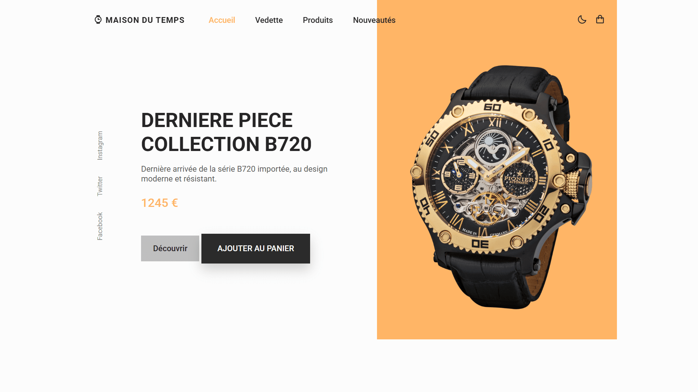

<div align="center">  
    <a href="https://watch-store-vm.netlify.app/" target="_blank">  
        
    </a>
    </br>  
    </br>  
  <h3 align="center">⌚ Maison du Temps &nbsp; — &nbsp; Horlogerie de Luxe</h3>  
</div>

## <br /> 📌 Sommaire

&nbsp;&nbsp;&nbsp; 🎨 &nbsp; [**Introduction**](#introduction)<br />
&nbsp;&nbsp;&nbsp; 🛠️ &nbsp; [**Technologies**](#technologies)<br />
&nbsp;&nbsp;&nbsp; 🎯 &nbsp; [**Fonctionnalités**](#fonctionnalités)<br />
&nbsp;&nbsp;&nbsp; 🚀 &nbsp; [**Installation**](#installation)<br />

## <br /> <a name="introduction">🎨 Introduction</a>

Maison du Temps est une **landing page** raffinée pour une horlogerie de luxe, présentant une sélection de montres modernes à travers un design épuré, immersif et responsive. Elle intègre un thème sombre, des carrousels **Swiper.js** pour les avis et les produits, ainsi que des animations fluides avec **ScrollReveal**.

## <br /> <a name="technologies">🛠️ Technologies</a>

- HTML5 sémantique et structuration claire
- CSS3 moderne avec variables et media queries
- JavaScript ES6 clair et modulaire
- [Swiper.js](https://swiperjs.com/) pour les carrousels produits et témoignages
- [Boxicons](https://boxicons.com/) pour des icônes vectorielles modernes
- Responsive Design pensé en mobile-first

## <br /> <a name="fonctionnalités">🎯 Fonctionnalités</a>

- Thème sombre activable localement via le localStorage
- Section d’accueil immersive avec call-to-action
- Section Vedette avec produits en promo
- Section Histoire valorisant la marque
- Catalogue produits défilant avec bouton d’achat
- Carrousel d’avis clients animés
- Section Nouveautés animée avec swiper synchronisé
- Formulaire d’inscription à la newsletter
- Scroll up et liens actifs dynamiques au scroll
- Responsive complet et animations fluides

## <br /> <a name="installation">🚀 Installation</a>

### ✅ Prérequis

- [Google Chrome](https://www.google.com/) &nbsp;—&nbsp; Navigateur moderne
- [Visual Studio Code](https://code.visualstudio.com/) &nbsp;—&nbsp; Éditeur de code
- [Live Server](https://marketplace.visualstudio.com/items?itemName=ritwickdey.LiveServer) &nbsp;—&nbsp; Extension VS Code

### 📥 Cloner le projet

```bash
git clone git@github.com:ValentinMadiot/watch-store_ui
cd watch-store_ui
```

### ▶️ Lancer le projet

Il suffit d’ouvrir le fichier `index.html` dans un navigateur, ou d’utiliser l’extension **Live Server** sur VS Code pour un aperçu dynamique.
